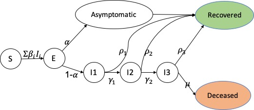

This repository includes the script to monitor the Covid-19 spread using effective reproduction number and project the number of estimated cases based on the current data. Missouri data is being used here to evaluate the model and statistics. 

**Disclaimer**: the model is as good as the data inputed and assumption made on the disease. And like all the models they are probablistics with uncertainties. Please use them with cautious and check what data and assumptions have been used in model.

## Reproduction number
Tnere are two common types of reproduction number being used in epidemiology. Basic reproduction number (or $R_0$) and effective reproduction number (or $R_e$ or $R_t$). 

The basic reproduction number is defined as the number of cases that are expected to occur on average in a homogeneous population as a result of infection by a single individual when there is zero immunity in the population. The effective reproduction number, is the number of people in a population who can be infected by an individual at any specific time. The number can be used to monitor pathogen's transmissibility during an epidemic. Society's behavior such as social distancing, immunity due to vaccination or recovery, will impact this metric.

The reproduction number, R, is the average number of secondary cases of disease caused by a single infected individual over his or her infectious period. .
The dashboard is using two different methods to calculate `Re`:

1. Re using Serial Interval (SI)

## SEIR Model

There are multiple epedimiological models (such as SIR, SEIR, SIRS) developed to simulate and project disease transmission within a community or graph. Based on the disease attributes different models can be more useful. The SEIR models the flows of people between four states: susceptible (S), exposed (E), infected (I), and resistant (R) in a given community. In order to model how disease is transmitting in a community (city, county, ...), SEIR gets in different clinical and community-related features and simulate how individuals within the community changes their status from being Susceptible to Exposed to Infected to Resistant. Below are the list of features we have considered to model how Covid-19 impacts the people in a society. We categorized those into clinical and socio-economic features. The image below visualizes the phase transmission in a community and it shows how those parameters are implemented in the model

### Clinical Features:

- **Incubation period**: time between being exposed to a disease and when the symptoms start
- **Asymptomatic infectious rate ($\alpha$)**: percentages of the cases where individual does not develop symptoms.
- **Mild symptomatic rates (1 - $\alpha$)**: percentages of the cases where individual develop mild symptoms.
- **Severe symptomatic rates ($\gamma_1$)**: percentages of the cases where individual hospitalized.
- **Critical symptomatic rates ($\gamma_2$)**: percentages of the cases where individual require ICU
- **Mortality rate ($\mu$)**: percentages of the cases who are deceased.
- **Asymptomatic to recover time**: the time it takes for individuals to recover and become resistant. We assume that recovered cases do not become susceptible again. Also we assume the infected individuals are contagious during this period.
- **Mild to recovery time**: time it takes for individuals to recover after developing symptoms
- **Mild to severe time**: time it takes for individual to hospitalized after developing symptoms
- **Severe to Critical time**: time it takes for hospitalized case to require ICU beds and ventilators

### Community Features:
- **Contact rate between asymptomatic and susceptible ($\beta_0$)**: Daily contact rate between an asymptomatic individual with the rest of the community
- **Contact rate between mild cases and susceptible ($\beta_1$)**: Daily contact rate between an mildly infected individual with the rest of the community
- **Contact rate between severe cases and susceptible ($\beta_2$)**: Daily contact rate between a hospitalized individual with the rest of the community
- **Contact rate between critical cases and susceptible ($\beta_3$)**: Daily contact rate between a severely infected individual with the rest of the community
- **Community population**
- **initial confirmed day**: the date when first case is confirmed
- **Initial confirmed number**: number of confirmed individuals on first day

